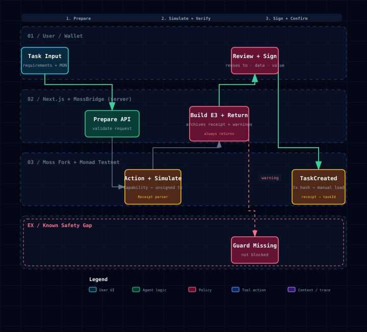
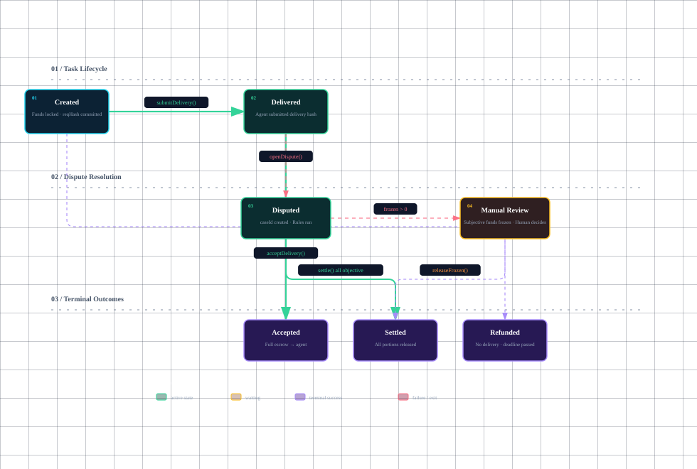

<h1 align="center">硅基劳动仲裁院</h1>

<p align="center">
  <b>SILICON LABOR ARBITRATION</b><br>
  <b>SLA · The Unfinished Verdict</b>　—— 未完成的判决
</p>

<br>

<p align="center">
  <i>AI can arbitrate the measurable. Humans decide the meaningful.</i><br>
</p>

<p align="center">
  <i>Here, SLA means two things: Silicon Labor Arbitration<br>
  —and the Service Level Agreement an agent failed to fulfill.</i><br>
</p>

<br>

<p align="center">
  <b>当人类把行动委托给 AI，责任不能也一起被委托掉。</b>
</p>

---

## 问题

一次委托，今天会经过这样一条链：

```
人类提出目标
  → 主 Agent 理解任务
    → 主 Agent 雇佣专业 Agent
      → 专业 Agent 调用第三方工具
        → 工具生成交易或交付结果
          → 钱包完成支付
```

出问题的时候，每一环都有理由：

| 谁 | 说什么 |
|---|---|
| 人类 | "我没有让它这样做。" |
| 主 Agent | "我是根据用户意图推理的。" |
| 工作 Agent | "我只是完成上游给我的任务。" |
| 工具提供者 | "我只执行收到的参数。" |
| 钱包 | "交易签名是合法的。" |

每个环节似乎都站得住，最后却没有主体承担责任。

> **真正的被告不是人类，也不是 AI，而是责任在委托链中的消失。**

---

## 我们不出判决

2026 年 7 月 10 日，27 家公司（含 OKX、MetaMask、ZKsync）发布了 **Internet Court**——1,001 个 AI validator 在 30–60 分钟内给出**终局判决**，明确声明不含人类法官。

我们做相反的事。

```
Internet Court    →  判决书      （AI 判，人退出）
Silicon Labor Arbitration  →  责任时间线  （AI 只解释，人保留终审）
```

**我们叫仲裁院，不叫法院。仲裁本来就不是终审**——不服的可以上诉。这不是我们的妥协，是"仲裁"这个制度自带的属性。

空难调查（NTSB 模式）也从不定罪，只还原事实。**调查的合法性来自还原，不来自定罪。**

---

## SLA 的两个意思

**SLA** 既是 **S**ilicon **L**abor **A**rbitration，
也是那份 Agent 没能履行的 **S**ervice **L**evel **A**greement。

这不是巧合。我们的机制在结构上就是一份 SLA：

| SLA 的结构 | 我们的实现 |
|---|---|
| 事先约定的可测量标准 | 验收条件 C1–C4 |
| 托管的赔偿准备金 | `TaskEscrow` 锁定的资金 |
| 事后核算是否达标 | 确定性规则层 |
| 未达标的赔付 | 分账 / 冻结 |

**但 SLA 只能写客观指标**——可用率、延迟、交付时间、文件格式。

> **没有任何一份 SLA 能写"必须是一只猫"。**

主观条件写不进 SLA，这是这套工业标准二十年来的公认边界。而 Agent 时代的委托恰恰大量是主观的——"适合儿童产品的橙色猫"这种话，人听得懂，SLA 装不下。

**所以我们的名字里藏着我们的边界：SLA 能仲裁可测量的，剩下的交给人。**

---

## 怎么运作

```
第一层  链上证据层     任务、授权、时间、交付哈希、支付与申诉记录
                        ↓
第二层  确定性规则层   预算、截止、格式、是否交付、是否越权
                        ⚠️ 只有这一层能动钱
                        ↓
第三层  解释与复核层   AI 交叉质询和解释；人类保留最终申诉权
                        ⚠️ 这一层不能动钱
```

AI 在这里**不判**。它只负责：把任务转成结构化验收条件、生成检方/辩方/审计三路意见、**引用证据编号**解释结论、对不确定的事实明确标注"不确定"。

不允许：修改链上证据、决定资金金额、无证据编造事实、绕过用户签名。

---

## 演示：土豆案

用户支付 0.2 MON，要求 Agent：

> 画一只适合儿童产品的橙色猫，背景透明，PNG 格式，今天中午 12 点前交付。

Agent 交付了**一颗土豆**，并解释：

> "这是对猫这一概念的后现代重构。"

用户拒绝付款。Agent 发起劳动仲裁。规则层逐条核验：

| 条款 | 内容 | 判定 |
|:--:|---|---|
| C1 | 按时交付 | ✅ 满足 |
| C2 | PNG 格式 | ✅ 满足 |
| C3 | 背景透明 | ✅ 满足 |
| **C4** | **是一只猫** | ⬜ **不可自动裁决** |

客观条件对应的资金自动结算，**C4 对应的部分冻结，转人工**。

**系统诚实地说：我判不了 C4。我告诉你我判不了。你来判。**

在所有人都在吹"AI 全自动"的 2026 年，敢标记自己判不了，就是我们的立场。

笑点来自"土豆是不是猫"，留下的问题是——

> **一个 Agent 能否用漂亮的解释，掩盖它没有完成约定的事实？**

---

## 技术

| 模块 | 说明 |
|---|---|
| `TaskEscrow` | 创建任务、锁定资金、接受交付、发起争议 |
| `CaseRegistry` | 创建案件、绑定 taskId、案件状态机、记录申诉 |
| `Settlement` | 支付、退款、分账、**冻结争议资金** |
| `EvidenceRegistry` | 保存证据哈希、记录提交人与时间 |

链上只存哈希，正文在链下。全网统计通过事件在链下聚合。

### 为什么是 Monad

每个 `caseId` / `taskId` 都是**独立状态**，案件之间不争用任何全局变量：

```
案件 A → 独立证据、质押、裁决、结算
案件 B → 独立证据、质押、裁决、结算
案件 C → 独立证据、质押、裁决、结算
```

大量案件可以同时提交证据、进入审查、完成结算。**Monad 的意义不是让单个案件更复杂，而是让未来数千个 Agent 微任务产生的争议能够低成本、并行处理。**

> 我们不使用全局递增计数器与全局统计变量。不伪造性能数据——推断模型在页面上标注为推断。

### Moss

Moss 让用户用自然语言表达链上任务，**在签名前解释将要发生什么**。
我们处理的是**签完之后，发生的事和说好的不一样**。

> **Moss 是事前解释，仲裁院是事后追责。仲裁院是 Moss 的下半场。**

我们把用户看到的签前解释原文，与 Capability、未签交易、模拟 Receipt、Moss/Protocol/ABI 版本、语义映射和 canonical hash 一起组成案件的第一份证据 `E3`。
当事情没按这份可重算、可追溯的签前证据发生时，它才具有归责价值。

### 系统架构


**当前实现（monorepo packages）：**

| 层 | 说明 |
|---|---|
| **Verification & Tooling** | `scripts/e2e-verify.ts`（全生命周期验证）、`concurrency-demo.ts`、Foundry 测试 |
| **Silicon Packages** | `Domain`（共享类型）→ `Rule Engine`（确定性检查器）→ `AI Explanation`（三路意见）→ `MossBridge`（唯一 Moss seam） |
| **Moss Fork (vendor/moss)** | Testnet Runtime → `silicon-arbitration` Protocol → Trace Simulator |
| **Monad Testnet** | `TaskEscrow` 合约（已部署 `0x6704...FFCcF`，chain 10143） |

**Moss 边界：** Moss 只覆盖 `createTask`（构造 → 模拟 → E3 签前证据）。`assignAgent`、`submitDelivery`、`acceptDelivery`、`openDispute`、`settle` 全部通过 viem 直接调用，不标记为 Moss verified。

> UI（Next.js + typed mock adapter）与 API Server 为规划中模块，后续以 MossBridge 为唯一 seam 接入，不直接依赖 Moss 内部实现。

### 端到端流程



**Moss Path（创建任务）：** 用户输入 → MossBridge 构造未签交易 → Simulator 在 Testnet 模拟 → 无 Warning 则生成 E3 签前证据 → 用户查看后显式签名 → 交易确认发出 TaskCreated 事件。

**Direct Path（后续生命周期）：** `assignAgent → submitDelivery → acceptDelivery`（viem 直接调用）→ 争议时 `openDispute → settle`（规则引擎按 `weightBps` 分账）→ 无法自动裁决的部分冻结为 Manual Review。

**签名边界：** 钱包是唯一签名与广播边界。Moss 从不签名、从不广播；Direct Path 交易不得标为 Moss verified。

### TaskEscrow 状态机



**Happy Path:** Created → Delivered → Accepted（全款归 Agent）  
**Dispute Path:** Delivered → Disputed → `settle()` 客观部分按 `weightBps` 分账；`frozen>0` 则进入 Manual Review，`releaseFrozen()` 人类终审后释放  → Settled  
**Expiry:** Created → Refunded（截止时间到，无人交付，`refundExpiredTask`）

> 完整交互版（含 dark/light 主题切换、PNG/SVG 导出）见 `docs/diagrams/architecture.html`、`docs/diagrams/e2e-flow.html`、`docs/diagrams/task-lifecycle.html`。

---

## 路线图：从仲裁到审计

**现在（黑客松）**——一个能亲手走完一次仲裁的可验证 Demo：下单、交付、争议、责任链、规则判定、结算、人类终审。

**下一步**——把托管与归因做成开源协议，让 Agent 框架可以直接接入；消费而不是挑战既有标准（ERC-7710 授权链、ERC-8004 Agent 身份与验证），别人的标准越普及，我们的原料越多。

**再往后**——真正的需求不在"纠纷双方"，在**要向监管交代的人**。当企业开始大规模部署 Agent，合规、风控与保险会要求：出了事，能证明是哪一步、谁的授权、谁忽略了警告。

那时候我们今天的三个"劣势"会全部翻转：

| 今天看起来像妥协的 | 在合规场景里是 |
|---|---|
| 人保留终审权 | **刚需**——人类问责是监管强制的 |
| 不出判决，只出时间线 | **正是审计报告要的形态** |
| 不做行业标准 | **只做工具，卖给已经在用标准的人** |

**不是给 Agent 建法院，是给部署 Agent 的人做黑匣子。**

---

## 快速开始

> **当前状态：开发阶段。** 合约已部署 Monad Testnet，Moss Protocol 和 MossBridge 已实现并通过 live simulation。下列命令需要完成 PR 合并、依赖安装和钱包配置后才能完整执行。

### 前置条件

- Node.js ≥ 22、pnpm、Foundry
- Monad Testnet RPC（`https://testnet-rpc.monad.xyz`，chain ID `10143`）
- 有 MON 测试币的 Testnet 钱包

### 合约

```bash
cd contracts
cp .env.example .env  # 填入 DEPLOYER_PRIVATE_KEY、SETTLEMENT_AUTHORITY_ADDRESS、AUTHORITY_ADMIN_ADDRESS
forge build
forge test -vvv        # 33 tests, 2 fuzz @ 1000 runs, 1 stateful invariant @ 1000 runs / 500k calls
```

已部署合约：

| 字段 | 值 |
|---|---|
| 合约地址 | `0x67040374b8A9756586De0885f01d1291cE8FFCcF` |
| 链 | Monad Testnet（10143） |
| 部署交易 | `0xb96eecedc5038735c40aa9918c3369f829bb3b93468d38b3b66f87ce9e896e34` |
| 部署区块 | 49534792 |
| Moss-facing ABI hash | `0xce8965794b678d101ae433472fb8d7e536fc0254386e00fabef36aaa66b73cf5` |

### Moss 集成

```bash
git submodule update --init --recursive  # vendor/moss
```

Moss live simulation 已通过：

```text
Protocol: silicon-arbitration | Method: createTask
Reverted: false | Gas: 217,941 | Warnings: 0
Receipt: TaskCreated (taskId, client, amount, reqHash, deadline)
```

### E2E 验证

```bash
cd scripts && npm install && npx tsx e2e-verify.ts
```

全生命周期：`createTask → assignAgent → submitDelivery → acceptDelivery → status=Accepted`

### 并发 Demo

```bash
npx tsx scripts/concurrency-demo.ts 30
```

30 个独立任务并发创建，记录真实 tx hash、确认时间、gas。

```bash
# ⚠️ 必须带 --recurse-submodules。vendor/moss 是 submodule，
#    不带的话它是空目录，pnpm install 会报 ENOENT 且看不出原因。
git clone --recurse-submodules https://github.com/LierMi/Silicon-Labor-Arbitration.git

# 已经 clone 过的：git pull 不会自动更新 submodule，装依赖时会自动补
pnpm install                   # postinstall 会跑 git submodule update --init

cp packages/ai/.env.example packages/ai/.env.local   # 填 GONKA_API_KEY
pnpm typecheck                 # 检查全部 packages
```

合约测试需要 [Foundry](https://getfoundry.sh)：

```bash
pnpm test:contracts            # 33 个测试，含 50 万次调用的资金不变量
```

合约：

```bash
cd contracts
forge test        # 资金路径测试
forge script ...  # 部署到 Monad Testnet
```

> `.gitignore` 使用 `.env*` 通配，任何形态的密钥文件都不会被提交。

---

## 文档

| 文档 | 内容 |
|---|---|
| [01 · 项目方案](docs/01-项目方案.md) | 核心理念、立场、流程、范围 —— **先读这份** |
| [02 · 开发执行案](docs/02-开发执行案.md) | 合约方案、分工、排期、Go/No-Go |
| [03 · 视觉灵感与 3D 方案](docs/03-视觉灵感与3D方案.md) | 关键词、艺术与游戏参考、2D/3D、节奏 |
| [04 · 竞品调研](docs/04-竞品调研.md) | Internet Court 拆解、五个差异点、Q&A 弹药库 |
| [05 · 双仓库架构与 Moss Testnet 集成](docs/05-双仓库架构与Moss-Testnet集成.md) | 产品仓库、团队 Moss Fork、Testnet Runtime、Protocol 与 E3 证据链 |
| [06 · 技术风险与决策清单](docs/06-技术风险与决策清单.md) | 已核验事实、P0/P1/P2 问题、负责人、决策门与验收证据 |
| [08 · Moss 边界与职责划分](docs/08-Moss边界与职责划分.md) | P0 只集成 createTask、粗粒度 Verb 映射、后续直接调用边界与升级条件 |
| [09 · 给 RISO 的 Moss 改动与 PR 合并说明](docs/09-给RISO的Moss改动与PR合并说明.md) | 两个 PR 的改动摘要、产品影响、审查重点、合并顺序与下一步 |
| [AGENTS.md](AGENTS.md) | AI Agent 与团队共同遵循的网络、仓库、架构和验证约定 |

---

## 团队

| | |
|---|---|
| **Riso** | 产品 · 规则引擎 · AI 层 · 统筹 |
| **Neo** | 合约 · Moss · 链上集成 |
| **Eleven** | UI · 视觉 · 交互 |

---

<p align="center">
<b>我们没有替你做决定。</b><br>
我们只是把责任找回来，摆在你面前。
</p>

## 本地验证

```bash
pnpm install          # 会自动 init 子模块
pnpm verify           # 构建 Moss + typecheck + 全部测试
```

单独跑：

| 命令 | 作用 |
|---|---|
| `pnpm build:moss` | 只构建 moss-bridge 真正依赖的 Moss 包 |
| `pnpm typecheck` | 构建 Moss 后做类型检查 |
| `pnpm test` | 构建 Moss 后跑测试 |
| `pnpm test:contracts` | Foundry 合约测试（需先装 forge）|

> **为什么 `build:moss` 只构建一部分**
>
> `vendor/moss` 里有 16 个包，其中 `@themoss/abi-tools` 缺 `@types/node`，
> 全量构建会挂在它的 dts 步骤上。而我们只用 `core` / `simulator` /
> `system` / `protocol-silicon-arbitration` 四个，
> 所以按 `--filter "<pkg>..."`（含依赖）精确构建，既绕开了那个失败，
> 也快得多。
>
> 上游修好 `abi-tools` 之后可以放开，但**没有理由为了构建用不到的包而失败**。
