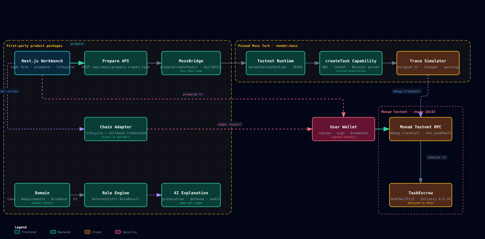

<div align="center">

# 硅基劳动仲裁院

### 面向 Agent 经济的证据化责任基础设施

**确定性规则处理可测量条件，AI 只解释证据，人类保留最终决定权。**

[](./README.md)
[](./README.zh-CN.md)

[](https://silicon-labor-arbitration.vercel.app/)
[](https://testnet.monadexplorer.com/address/0x67040374b8A9756586De0885f01d1291cE8FFCcF)
[](https://nextjs.org/)
[](https://react.dev/)
[](https://www.typescriptlang.org/)
[](./LICENSE)

[完整体验](https://silicon-labor-arbitration.vercel.app/demo) · [案件工作台](https://silicon-labor-arbitration.vercel.app/workbench) · [法庭页](https://silicon-labor-arbitration.vercel.app/courtroom) · [链上合约](https://testnet.monadexplorer.com/address/0x67040374b8A9756586De0885f01d1291cE8FFCcF)

</div>

---

## 30 秒项目概述

硅基劳动仲裁院是面向 AI Agent 委托工作的链上责任层。当任务从人类依次经过主 Agent、专业 Agent、第三方工具和钱包时，责任很容易在多次转交中消失。本项目不让另一个 AI 给出终局判决，而是把委托链重建为可验证证据。

| | 含义 |
| --- | --- |
| **项目定位** | 面向 Agent 交付的责任时间线与结算系统，而不是 AI 法院。 |
| **核心创新** | 客观条件可进入确定性结算；主观条件始终保持 `undecidable`，交由人类复核。 |
| **Moss 集成** | Moss 在签名前构造并模拟未签名的 `createTask` 交易；钱包仍是唯一签名与广播边界。 |
| **Monad 原生价值** | 托管状态、承诺、生命周期事件与结算证据记录在 Monad Testnet，并使用任务级独立状态。 |
| **核心演示** | 用户委托“橙色猫”，Agent 却交付土豆：格式条件满足，语义条件无法判定，系统拒绝伪造确定性。 |

> **我们不出终局判决。我们只是把责任找回来，摆在人类复核者面前。**

## 为什么做这个项目？

我们项目的故事，开始于一只猫。

用户支付 0.2 MON，委托 Agent 画一只橙色的、适合儿童产品的猫。Agent 按时交付了 PNG，背景透明，格式完全合规——但它交付的是一颗土豆。

甚至，它还能像一个当代艺术家一样非常漂亮地解释：“这是对猫这一概念的后现代重构。” 从艺术角度来看，好像听上去还挺像那么回事？

在 Agent 时代，**真正稀缺是责任**。

当一个决定，从人类交给主 Agent，再交给专业 Agent、第三方工具，最后变成钱包里的一笔支付——责任也在一次次转交中，被悄悄稀释了。

交易记录可以证明钱去了哪里，签名可以证明谁按下了确认；但它们无法回答：人的意图，究竟在哪一步被误解？当所有机器都“正确执行”，又该由谁为错误的结果负责？

这就是我们创造“硅基劳动仲裁院”的原因。我们不急着判谁对谁错，而是**重建一条不可抵赖的责任时间线**。

我们前期做调研的时候发现有一个 7 月刚刚上线的产品——Internet Court，它用 1,001 个 AI 陪审员快速给出终局判决。我们却认为，更多 AI 并不会天然产生正义。**真理不一定是掌握在多数Agent手里的。投票可以制造答案，却不能赋予答案合法性。**

所以，硅基劳动仲裁院不制造一个无所不知的 AI 法官。它只还原责任：谁提出要求，谁接受委托，谁调用工具，谁签署交易，又是谁交付了那颗土豆。

技术上，我们以 Monad Testnet 承载托管和责任记录，以 Moss 完成签名前构造与模拟，以钱包守住最终授权边界。

**我们想守住的，不只是一笔钱，而是 AI 时代最后一个不能被自动化的权利——人类对意义的最终解释权。**

## 问题

Agent 工作形成了一条很长的委托链：

```text
人类意图
  → 主 Agent
    → 专业 Agent
      → 第三方工具
        → 交易或交付
          → 钱包与支付
```

结果出错时，每个参与者都可以指向上一条指令。合法签名只能证明交易得到了授权，不能证明最终交付符合人类最初的真实意图。

现有方案往往继续让 AI 陪审团给出确定答案。硅基劳动仲裁院采取相反立场：**先还原事实，以确定性规则执行可测量承诺，把主观意义保留给人类复核。**

## 解决方案

协议把责任分为三层：

| 层级 | 职责 | 能否移动资金 |
| --- | --- | :---: |
| **链上证据层** | 任务创建、托管、Agent 指派、交付哈希、争议、结算承诺与生命周期事件 | 通过合约规则 |
| **确定性规则层** | 截止时间、文件格式、透明通道、权限、金额守恒等客观条件 | **可以** |
| **AI 解释与人类复核层** | 引用证据的检方、辩方、审计观点，以及主观条件复核 | **不可以** |

```text
客观条件 → satisfied / violated / 因证据缺失而 undecidable
主观条件 → 始终 undecidable → 人类复核
```

## 主要使用场景

- **Agent 外包交付**：还原客户要求、Agent 接受的授权、执行前看到的警告，以及最终交付结果。
- **DAO 与团队采购**：以可测量条件托管付款，同时为质量与意图等主观要求保留人类复核。
- **自动化服务 SLA**：确定性处理截止时间、文件属性等客观违约，不假装代码能判断主观意义。
- **Agent 审计与事故复盘**：为运营方、合规团队和 Agent 框架开发者提供防篡改责任时间线。

## 主要亮点

### 1. 诚实地承认不确定性

演示案件中，C1–C3 可以测量；C4“交付物是不是一只猫”属于主观条件，必须保持 `undecidable`。那个落不下去的空章位是系统的信任边界，不是未完成功能。

### 2. Moss 是核心依赖，不是品牌装饰

任务创建路径使用固定版本的团队 [Moss Fork](https://github.com/LierMi/moss)：

```text
discover → load → action → simulate → 签前证据 E3
```

Moss 构造并模拟未签名的 `TaskEscrow.createTask` 交易，但**绝不**保存私钥、签名、广播或裁决争议。模拟发生 revert 或终止性 Warning 时，产品不会把交易交给钱包。

### 3. 钱包是签名边界

钱包收到的 `chainId`、`to`、`data` 与 `value` 必须与 Moss 模拟的交易完全一致。签名后的回执再绑定到签名前的 E3，从而证明用户批准前看到了什么解释。

### 4. AI 解释证据，但无法分配资金

AI 输出结构只有 `role`、`text`、`cites` 和 `uncertain`。结算金额与条款权重不会进入模型输入；缺少引用或引用未知证据的意见会被拒绝。

### 5. 结算保留主观价值

合约强制金额守恒：

```text
toAgent + toClient + frozen = escrowed
```

与未解决主观条件关联的资金可以继续冻结，直到提交明确的人类复核承诺。

## 在线演示

| 入口 | 用途 |
| --- | --- |
| [开屏页](https://silicon-labor-arbitration.vercel.app/) | 项目定位与叙事入口 |
| [完整体验](https://silicon-labor-arbitration.vercel.app/demo) | 六幕责任重建体验 |
| [案件工作台](https://silicon-labor-arbitration.vercel.app/workbench) | 钱包驱动的任务生命周期与演示 Agent 操作 |
| [法庭页](https://silicon-labor-arbitration.vercel.app/courtroom) | 证据时间线、规则结果、AI 意见和人类复核边界 |

### 演示数据模式

| 模式 | 哪些内容真实 | UI 标签 |
| --- | --- | --- |
| **演示 Fixture**（默认） | 合约部署和实现真实；页面案件叙事是固定样例，本案未广播 | `DEMO` |
| **混合模式** | 任务状态与金额来自 Monad Testnet；证据叙事仍是演示数据 | `HYBRID` |

在体验页或法庭页 URL 后附加 `?taskId=0x...`，可强制读取指定链上任务。若读取失败，UI 会回退到明确标注的演示 Fixture。

**演示账号**：无。无需账号即可浏览叙事体验；链上写入需要连接 Monad Testnet 且持有测试 MON 的浏览器钱包。

## 端到端流程

```text
1. 客户定义条款、截止时间与托管金额
2. 条款经过规范化并生成哈希
3. Moss 加载 silicon-arbitration.createTask
4. Moss 构造未签交易并在 Monad Testnet 模拟
5. 应用生成签前证据 E3
6. 客户在钱包中检查并签署同一笔模拟交易
7. TaskEscrow 记录任务、资金与 TaskCreated 事件
8. 被指派 Agent 提交交付承诺
9. 确定性规则检查可测量证据
10. 主观条件保持 undecidable
11. 确定性结算执行付款、退款或冻结
12. 人类通过复核承诺释放冻结部分
```

## 技术架构

<p align="center">
  
</p>

```text
浏览器 / 钱包
  ├── Next.js 体验页与工作台
  ├── wagmi + viem 钱包边界
  └── DEMO / HYBRID 案件适配器
            │
            ▼
产品模块
  ├── @sla/domain       共享案件与证据契约
  ├── @sla/rules        确定性客观规则引擎
  ├── @sla/ai           引用证据的解释层
  ├── @sla/chain        ABI、链上读取与后续直接写入
  └── @sla/moss-bridge  prepare → simulate → E3
            │
            ▼
固定版本的团队 Moss Fork
  └── Monad Testnet Runtime + silicon-arbitration Protocol
            │
            ▼
Monad Testnet
  └── TaskEscrow
```

### Moss 路径与直接交易路径

| 操作 | 路径 | 证据标签 |
| --- | --- | --- |
| `createTask` | Moss Capability → 模拟 → 钱包 | Moss E3 |
| `assignAgent`、`submitDelivery`、`acceptDelivery`、`openDispute` | 产品交易构造器 → 钱包 | 直接链上证据 |
| `settle`、`releaseFrozen`、`withdrawPayment` | 授权方直接合约路径 | 直接链上证据 |

后续生命周期写入不会被错误描述为 Moss verified 操作。

## 链上证据

部署事实源为 [`deployments/monad-testnet.json`](./deployments/monad-testnet.json)。

| 字段 | 值 |
| --- | --- |
| 网络 | Monad Testnet |
| Chain ID | `10143`（`0x279f`） |
| 合约 | [`TaskEscrow`](https://testnet.monadexplorer.com/address/0x67040374b8A9756586De0885f01d1291cE8FFCcF) |
| 地址 | `0x67040374b8A9756586De0885f01d1291cE8FFCcF` |
| 部署交易 | [`0xb96e...96e34`](https://testnet.monadexplorer.com/tx/0xb96eecedc5038735c40aa9918c3369f829bb3b93468d38b3b66f87ce9e896e34) |
| 部署区块 | `49534792` |
| Runtime Bytecode | `6021` bytes |
| Moss-facing ABI hash | `0xce8965794b678d101ae433472fb8d7e536fc0254386e00fabef36aaa66b73cf5` |
| 固定 Moss commit | `b00ed2db0454219e468e8a0e4928c364a869fb79` |

E3 保存 Capability 参数、未签交易、模拟回执、Warnings、签前解释、Chain ID、合约地址、ABI hash、Moss 版本、Protocol 版本、去敏 RPC 指纹与 canonical payload hash。

## 主要功能

- 带条款与截止时间承诺的资金托管任务创建。
- 客户指派 Agent，且只有被指派 Agent 可以提交交付。
- 交付验收、超时退款和案件参与方发起争议。
- 客观条件的确定性规则检查。
- 主观条件强制输出 `undecidable`。
- 引用证据的检方、辩方与审计意见。
- 绑定证据的结算与主观争议资金冻结。
- 人类复核后的冻结资金释放。
- 直接付款失败后的债权人延迟领取机制。
- 任务级重入保护与两步式结算权限轮换。
- 无需重写组件即可切换 Mock 与链上数据适配器。

## 技术栈

| 层级 | 技术 |
| --- | --- |
| Web 应用 | Next.js 15.5.22、React 19.2.8、TypeScript 5.6.2 |
| 交互 | GSAP、TanStack Query |
| 钱包与链交互 | wagmi 2.12.20、viem 2.55.10 |
| 智能合约 | Solidity 0.8.24、Foundry、Cancun EVM target |
| Agent 交易模拟 | Moss 团队 Fork、自定义 Monad Testnet Runtime、`silicon-arbitration` Protocol Package |
| 领域与规则 | TypeScript workspace packages、canonical evidence hashing |
| AI 解释 | Anthropic-compatible SDK；默认 Gonka，Anthropic 备选 |
| 网络 | 仅 Monad Testnet |
| 部署 | Next.js 使用 Vercel；合约使用 Foundry |

## 仓库结构

```text
.
├── apps/web/                 Next.js UI、API 路由、DEMO/HYBRID 适配器
├── contracts/                TaskEscrow、Foundry 测试、部署脚本、ABI
├── deployments/              版本化 Monad Testnet 部署证据
├── packages/
│   ├── ai/                   引用证据的 AI 解释
│   ├── chain/                链配置、ABI、交易构造器、wagmi hooks
│   ├── domain/               共享 Case、Evidence、RuleResult、E3 类型
│   ├── moss-bridge/          产品与 Moss 之间的稳定边界
│   └── rules/                确定性客观规则引擎
├── scripts/                  E2E 与并发证据脚本
├── vendor/moss/              固定版本的团队 Moss Fork submodule
├── docs/                     产品、架构、风险与演示文档
├── moss.lock.json            Moss 溯源锁文件
└── pnpm-workspace.yaml       Monorepo workspace 定义
```

## 安装与运行

### 前置条件

- 推荐 Node.js 22（根 `package.json` 要求 Node.js 20 或更高）
- pnpm `11.15.1`
- 支持 Git submodule 的 Git
- 合约构建与测试需要 [Foundry](https://getfoundry.sh/)
- 链上写入需要浏览器钱包与测试 MON

### 安装

```bash
git clone --recurse-submodules https://github.com/LierMi/Silicon-Labor-Arbitration.git
cd Silicon-Labor-Arbitration
corepack enable
pnpm install
```

如果克隆时没有下载 submodule：

```bash
git submodule update --init --recursive
pnpm install
```

必须先下载 submodule，再让 pnpm 解析 workspace，因为 `pnpm-workspace.yaml` 引用了 `vendor/moss` 下的 packages。

### 启动 Web 应用

```bash
cp apps/web/.env.example apps/web/.env.local
pnpm --filter @sla/web dev
```

打开 `http://localhost:3000`。默认数据源是带有明确标签的演示 Fixture。

### 运行完整验证

```bash
pnpm verify
pnpm test:contracts
```

`pnpm verify` 会构建项目所需的 Moss packages、检查产品 workspace 类型、运行 package tests，并构建 Next.js 应用。只有 `pnpm test:contracts` 需要 Foundry。

## 配置

### Web 与演示

| 环境变量 | 是否必需 | 默认值 | 用途 |
| --- | :---: | --- | --- |
| `NEXT_PUBLIC_CASE_SOURCE` | 否 | `mock` | 选择 `mock` 或 `live` 案件数据。 |
| `NEXT_PUBLIC_LIVE_TASK_ID` | 否 | 最近 20,000 个区块内的最新任务 | 指定一个 `bytes32` 链上 task ID。 |
| `DEMO_AGENT_ACTION_ENABLED` | 否 | 除非设为 `false`，否则开启 | 控制服务端演示 Agent 操作端点。 |
| `DEPLOYER_PRIVATE_KEY` | 条件必需 | 无 | 托管演示 Agent 操作与合约部署需要。只能使用测试网私钥。 |

### 重新生成 AI 解释

仓库中的土豆案演示使用已冻结且可追溯的 AI Fixture，路演过程中不会调用模型。

| 环境变量 | 是否必需 | 默认值 | 用途 |
| --- | :---: | --- | --- |
| `GONKA_API_KEY` | 条件必需 | 无 | 通过 Gonka 重新生成 AI 意见。 |
| `GONKA_BASE_URL` | 否 | `https://api.gonkarouter.io` | Anthropic-compatible API host。 |
| `GONKA_MODEL` | 否 | `moonshotai/Kimi-K2.6` | Gonka 模型 ID。 |
| `ANTHROPIC_API_KEY` | 条件必需 | 无 | 未配置 Gonka 时使用的备选供应商。 |
| `ANTHROPIC_MODEL` | 否 | `claude-opus-5` | Anthropic 模型 ID。 |

### 合约部署

复制 `contracts/.env.example` 为 `contracts/.env`，配置仅用于测试网的部署钱包，以及互不相同的 settlement authority 与 authority admin 地址。不得复用持有主网资产的钱包。

## 可用命令

| 命令 | 作用 |
| --- | --- |
| `pnpm --filter @sla/web dev` | 启动 Next.js 开发服务器。 |
| `pnpm build:web` | 构建生产版 Web 应用。 |
| `pnpm build:moss` | 只构建产品实际依赖的 Moss packages。 |
| `pnpm typecheck` | 构建 Moss 依赖并检查所有产品 packages/apps 类型。 |
| `pnpm test` | 构建 Moss 依赖并运行产品 package tests。 |
| `pnpm test:contracts` | 运行 Foundry 合约测试。 |
| `pnpm verify` | 运行 Moss 构建、类型检查、package tests 与 Web 构建。 |
| `npx tsx scripts/concurrency-demo.ts 30` | 提交独立测试网任务并记录交易证据。 |
| `cd scripts && npm install && npx tsx e2e-verify.ts` | 使用测试网账户执行直接任务生命周期。 |

## 部署

### Vercel Web 应用

公开部署地址为 [silicon-labor-arbitration.vercel.app](https://silicon-labor-arbitration.vercel.app/)。

| 设置 | 值 |
| --- | --- |
| Root directory | 仓库根目录 |
| Install command | `pnpm install` |
| Build command | `pnpm build:web` |
| Framework | Next.js |

确保 checkout 阶段可以获取 Git submodules。只有需要演示专用 Agent 操作端点时才配置 `DEPLOYER_PRIVATE_KEY`。非演示部署应设置 `DEMO_AGENT_ACTION_ENABLED=false`，并使用独立的真实 Agent 钱包代替服务端签名。

### 智能合约

```bash
cd contracts
cp .env.example .env
forge build
forge test -vvv
forge script script/DeployTaskEscrow.s.sol:DeployTaskEscrow \
  --rpc-url "$MONAD_TESTNET_RPC_URL" \
  --broadcast
```

项目只允许部署到 Monad Testnet。任何新地址、交易、区块、Bytecode hash 与 ABI hash 都必须先写入 `deployments/monad-testnet.json`，再更新 README。

## 安全与真实性边界

| 系统可以证明 | 系统不会声称 |
| --- | --- |
| 哪个任务与条款承诺被写入链上 | 哈希本身能证明链下内容的语义质量 |
| Moss 模拟了哪一笔未签交易 | Moss 签名、广播或裁决了交易 |
| 哪笔钱包交易得到确认、发出了哪些事件 | 合法签名就等于结果符合人类意图 |
| 客观规则如何产生结算提案 | AI 独立验证或选择了付款金额 |
| 哪些事实缺失或属于主观条件 | 主观意义可以被转换为客观判决 |

- 仅使用 Monad Testnet；主网资金和主网常量不得进入演示路径。
- 私钥、API Key、助记词与任何 `.env*` 文件不得提交。
- 服务端 Agent 签名器只是有明确标签的演示便利功能，不是生产信任模型。
- 链下证据正文需要可重现的 canonical serialization 与哈希。
- 并发脚本只报告捕获到的交易事实，不宣称未经验证的 TPS 或 finality。

## 当前限制

- Moss 有意只集成 `createTask`；后续写操作走 viem/wagmi 直接路径。
- 托管页面默认展示演示 Fixture。链上任务读取标记为 `HYBRID`，因为对应证据叙事仍是样例数据。
- 演示 Agent 操作端点从服务端演示私钥派生有测试币的 Agent 账户；生产部署必须改为独立 Agent 钱包。
- 当前没有生产级 Indexer 或去中心化证据正文存储。
- 人类复核治理目前由授权链上见证者与证据承诺表示，还不是去中心化复核网络。
- 项目永远不会自动解决 C4“交付物是不是一只猫”。

## 路线图

| 阶段 | 方向 |
| --- | --- |
| **当前** | 测试网托管、Moss 模拟任务创建、责任时间线、确定性规则、AI 证据解释、人类复核冻结/释放路径。 |
| **下一步** | 用完整捕获的真实证据替换 Hybrid 叙事映射，增加持久化索引，并强化独立 Agent 签名。 |
| **愿景** | 成为 Agent 框架、采购系统与受监管运营方可复用的责任和结算层。 |

## 项目文档

| 文档 | 内容 |
| --- | --- |
| [`docs/01-项目方案.md`](./docs/01-项目方案.md) | 产品定位与不可变原则 |
| [`docs/02-开发执行案.md`](./docs/02-开发执行案.md) | 交付范围与实施计划 |
| [`docs/05-双仓库架构与Moss-Testnet集成.md`](./docs/05-双仓库架构与Moss-Testnet集成.md) | 产品/Moss 仓库拓扑与运行架构 |
| [`docs/06-技术风险与决策清单.md`](./docs/06-技术风险与决策清单.md) | 风险、决策、负责人和证据门 |
| [`docs/08-Moss边界与职责划分.md`](./docs/08-Moss边界与职责划分.md) | 已接受的 Moss 边界：P0 只接入 `createTask` |
| [`AGENTS.md`](./AGENTS.md) | 仓库不变量与贡献者约束 |

## 团队

| 成员 | 负责方向 |
| --- | --- |
| **NEO** | 智能合约、Moss 与链上集成 |
| **RISO** | 产品、确定性规则、AI 解释与统筹、UI与前端 |
| **ELEVEN** | UI、视觉设计与交互 |

如希望围绕 Agent 框架、验证基础设施或真实设计伙伴场景合作，可通过 [Telegram](https://t.me/neo_web3_nova) 联系 NEO、[Telegram](https://t.me/Lier_Mi) Riso。

## 参与贡献

1. Fork 仓库并创建范围明确的分支。
2. 遵守 [`AGENTS.md`](./AGENTS.md) 中的产品不变量。
3. Moss 内部复杂度必须留在 `@sla/moss-bridge` 后，共享领域类型必须留在 `@sla/domain`。
4. 运行 `pnpm verify` 与相关 Foundry 测试。
5. 发起 PR 时明确描述行为、信任边界和验证证据。

## 许可证

本项目采用 [MIT License](./LICENSE)。

本软件仍处于实验阶段，仅部署于 Monad Testnet。它不是法律建议、法院判决或生产级资金托管服务。

---

<div align="center">

**我们想守住的，不只是一笔钱，而是 AI 时代最后一个不能被自动化的权利——人类对意义的最终解释权。**

</div>
